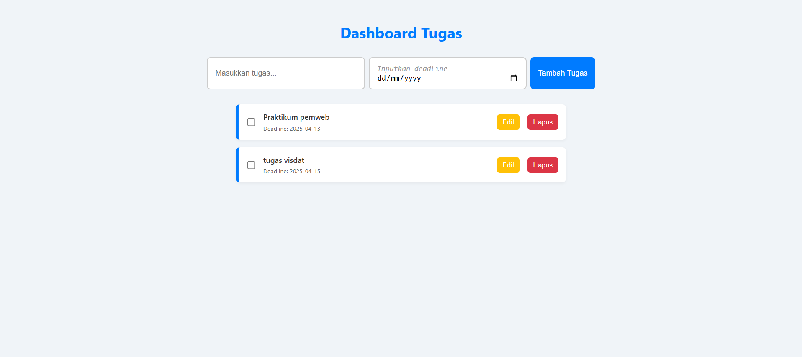

📋 Dashboard Tugas — Aplikasi To-Do Sederhana

Aplikasi ini adalah personal dashboard sederhana berbasis web yang memungkinkan pengguna untuk mencatat, menandai, dan mengelola daftar tugas harian mereka. 
Aplikasi bersifat interaktif dan menyimpan data secara lokal menggunakan `localStorage`, sehingga tetap tersimpan meskipun halaman direfresh.

---

🎯 Fitur Aplikasi

- ✅ Tambah tugas baru
- ✏️ Edit isi tugas yang sudah ada
- 🗑️ Hapus tugas dari daftar
- ✔️ Tandai tugas sebagai selesai (dengan centang dan coretan)
- 💾 Penyimpanan lokal dengan `localStorage`
- 🔁 Data bertahan saat halaman direfresh
- 🎨 Antarmuka sederhana dan responsif

---

---

🚀 Fitur JavaScript Modern (ES6+) yang Digunakan

| Fitur ES6+     | Implementasi                                                                 |
|----------------|------------------------------------------------------------------------------|
| `let` & `const`| Digunakan untuk deklarasi variabel secara tepat                              |
| Arrow Function | Untuk fungsi seperti `renderTasks`, `saveTasksToLocal`, dan `deleteTask`     |
| Template Literal | Untuk membuat elemen HTML secara dinamis dengan `${}`                      |
| Class          | Class `Task` untuk membuat objek tugas                                       |
| Async/Await    | `loadTasksFromLocal()` dan IIFE inisialisasi data dari `localStorage`        |

---
