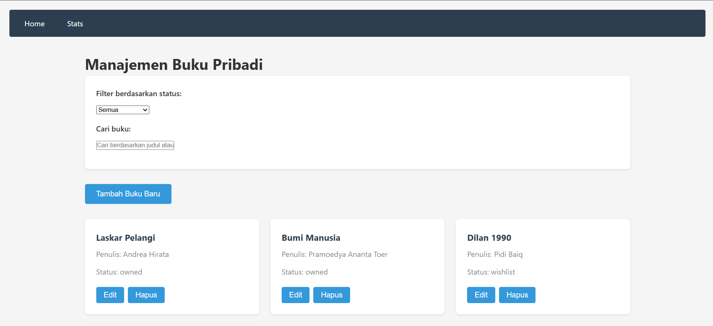
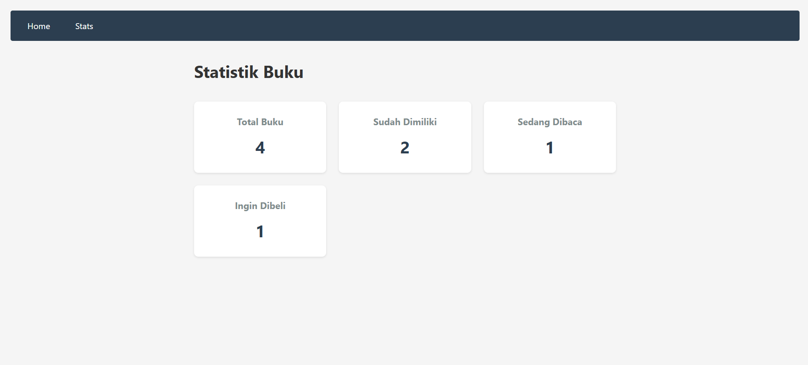

📚 Book Manager
Book Manager adalah aplikasi web sederhana untuk mengelola daftar bacaan Anda. Aplikasi ini memungkinkan pengguna untuk menambahkan, memfilter, dan melacak status buku (sudah dibaca atau belum). Dibuat dengan React dan disimpan secara lokal di browser menggunakan localStorage, aplikasi ini cepat, ringan, dan tidak memerlukan backend.

---

🚀 Fitur Utama
- Tambah buku dengan judul, penulis, dan status.
- Filter buku berdasarkan status bacaan (Semua, Sudah Dibaca, Belum Dibaca).
- Statistik jumlah buku total, dibaca, dan belum dibaca.
- Penyimpanan data lokal menggunakan `localStorage`.

---

🛠️ Instalasi & Menjalankan Secara Lokal
1. Clone repositori:
   git clone https://github.com/KennAustin/Pemrograman_web_itera_122140043/KennethAustin_122140043_Pertemuan3.git
   
   cd book-manager
   
3. Instal dependensi:
   npm install
   
4. Jalankan aplikasi:
   npm start

---

🖼️ Screenshot Antarmuka

---

⚛️ Fitur React yang Digunakan
useState	 => Mengelola state lokal komponen, Contoh implementasinya : const [books, setBooks] = useState([]);
useEffect => Menangani side effects (sync dengan localStorage), Contoh implementasinya :	useEffect(() => { localStorage.setItem('books', JSON.stringify(books)); }, [books]);
Context API =>	State management global untuk data buku, Contoh implementasinya :	const { books, addBook } = useBooks();
React Router v6 => Navigasi multi-halaman, Contoh implementasinya :	<Route path="/stats" element={<Stats />} />
Custom Hooks => Logika reusable untuk localStorage dan statistik, Contoh implementasinya :	const stats = useBookStats();
PropTypes => Validasi props komponen, Contoh implementasinya :	BookList.propTypes = { books: PropTypes.array.isRequired }
Testing Library => Unit testing komponen, Contoh implementasinya :	test('renders book list', () => { render(<BookList books={mockBooks} />); });

